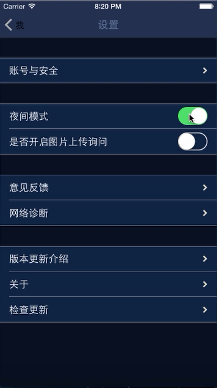
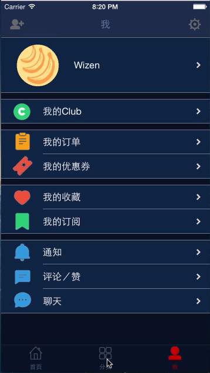

# 

   

# 仿堆糖画报，一款瀑布流布局的App

    出于爱好与学习的目的做出了这款瀑布流风格的应用，旨意通过涵盖iOS端的一些热门技术框架来打造一个面向市场级别的产品。

通过本项目，你可以了解到以下技术：

* Objective-C
* Xcode
* MVC
* Block
* Delegate 
* JSON
* AFNetworking
* NSThread
* iCarousel
* MJRefresh
* JSONModel
* FMDB
* MBProgressHUD
* SDWebImage
* MJExtension
* JXLDayAndNightMode
* UMSocial_Sdk
* 渐隐NavigationBar
* 抽屉
* 毛玻璃
* 夜间模式
## 预览

                                       


## 项目相关

### 项目环境

          

### 项目结构

```
Classes   
    - Main                           导航组件
    - Home                           主页
      - Model                        数据模型
      - View                         交互界面
      - Controller                   逻辑控制
      - Tool                         瀑布流布局类
    - Sort                           分类
      - Model                       
      - View                    
      - Controller                   
    - Me                             我
      - Model                        
      - View                         
      - Controller   
    - Setting                        设置                
    - Other                          三方库存放
      - Category
      - Lib                     
```

## 建议及问题反馈

+ E-mail: [wizen_zhang@163.com](wizen_zhang@163.com)
+ GitHub: [https://github.com/WizenZhang/DuiTang-iOS/issues](https://github.com/WizenZhang/DuiTang-iOS/issues)

## 致谢

感谢[Code4App](http://www.code4app.com/)和[李明杰](https://github.com/CoderMJLee)提供的iOS开源代码库，为本项目的形成提供了很大的帮助。

***

By [Wizen Zhang](https://wizenzhang.github.io/).
